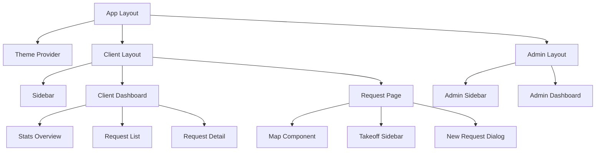

# High-Level Design (HLD) - Al-Measure
## AI-Powered Landscape Measurement Tool

---

## 1. System Overview

**Al-Measure** is a web-based landscape measurement and service request management platform that enables clients to create measurement requests, track their status, and manage property assessments through an interactive map interface.

### 1.1 Purpose
- Provide accurate landscape measurements using interactive maps
- Facilitate service request management for landscape services
- Enable role-based access for clients, employees, and administrators
- Streamline communication between clients and service providers

### 1.2 Key Features
- Interactive map-based measurement tools
- Service request creation and tracking
- Role-based dashboards
- Real-time measurement calculations
- Authentication and authorization
- Light/Dark theme support

---

## 2. System Architecture

### 2.1 Architecture Diagram

```
┌─────────────────────────────────────────────────────────────┐
│                        Client Layer                          │
│  ┌──────────────┐  ┌──────────────┐  ┌──────────────┐      │
│  │   Browser    │  │    Mobile    │  │    Tablet    │      │
│  │  (Chrome,    │  │   Browser    │  │   Browser    │      │
│  │  Firefox)    │  │              │  │              │      │
│  └──────────────┘  └──────────────┘  └──────────────┘      │
└─────────────────────────────────────────────────────────────┘
                            │
                            │ HTTPS
                            ▼
┌─────────────────────────────────────────────────────────────┐
│                    Presentation Layer                        │
│  ┌──────────────────────────────────────────────────────┐   │
│  │              Next.js 14 (App Router)                 │   │
│  │  ┌────────────┐  ┌────────────┐  ┌────────────┐    │   │
│  │  │   Client   │  │  Employee  │  │   Admin    │    │   │
│  │  │ Dashboard  │  │ Dashboard  │  │ Dashboard  │    │   │
│  │  └────────────┘  └────────────┘  └────────────┘    │   │
│  │  ┌────────────┐  ┌────────────┐  ┌────────────┐    │   │
│  │  │    Auth    │  │    Map     │  │  Request   │    │   │
│  │  │ Components │  │ Components │  │ Components │    │   │
│  │  └────────────┘  └────────────┘  └────────────┘    │   │
│  └──────────────────────────────────────────────────────┘   │
└─────────────────────────────────────────────────────────────┘
                            │
                            ▼
┌─────────────────────────────────────────────────────────────┐
│                     Business Logic Layer                     │
│  ┌──────────────────────────────────────────────────────┐   │
│  │                  API Routes (Next.js)                │   │
│  │  ┌────────────┐  ┌────────────┐  ┌────────────┐    │   │
│  │  │   Auth     │  │  Request   │  │   User     │    │   │
│  │  │    API     │  │    API     │  │    API     │    │   │
│  │  └────────────┘  └────────────┘  └────────────┘    │   │
│  │  ┌────────────┐  ┌────────────┐                     │   │
│  │  │ Validation │  │   Zustand  │                     │   │
│  │  │  (Zod)     │  │   Store    │                     │   │
│  │  └────────────┘  └────────────┘                     │   │
│  └──────────────────────────────────────────────────────┘   │
└─────────────────────────────────────────────────────────────┘
                            │
                            ▼
┌─────────────────────────────────────────────────────────────┐
│                      Data Layer                              │
│  ┌──────────────────────────────────────────────────────┐   │
│  │                  MongoDB (Mongoose)                  │   │
│  │  ┌────────────┐  ┌────────────┐  ┌────────────┐    │   │
│  │  │    Users   │  │  Requests  │  │  Updates   │    │   │
│  │  │ Collection │  │ Collection │  │ Collection │    │   │
│  │  └────────────┘  └────────────┘  └────────────┘    │   │
│  └──────────────────────────────────────────────────────┘   │
└─────────────────────────────────────────────────────────────┘
                            │
                            ▼
┌─────────────────────────────────────────────────────────────┐
│                   External Services                          │
│  ┌──────────────┐  ┌──────────────┐  ┌──────────────┐      │
│  │   OpenLayers │  │  Nominatim   │  │    Google    │      │
│  │   (Mapping)  │  │  (Geocoding) │  │  Satellite   │      │
│  └──────────────┘  └──────────────┘  └──────────────┘      │
└─────────────────────────────────────────────────────────────┘
```

### 2.2 Technology Stack

#### Frontend
- **Framework**: Next.js 14 (App Router)
- **Language**: TypeScript
- **Styling**: TailwindCSS 4
- **UI Components**: Radix UI, shadcn/ui
- **State Management**: Zustand
- **Forms**: Manual validation with Zod schemas
- **Mapping**: OpenLayers
- **Geospatial**: Turf.js
- **Themes**: next-themes

#### Backend
- **Runtime**: Node.js (Next.js API Routes)
- **Database**: MongoDB
- **ODM**: Mongoose
- **Authentication**: JWT (jsonwebtoken)
- **Password Hashing**: bcryptjs
- **Validation**: Zod

#### DevOps
- **Hosting**: Vercel
- **Analytics**: Vercel Analytics
- **Version Control**: Git

---

## 3. Component Architecture

### 3.1 Core Components



### 3.2 Component Hierarchy

**Client Flow:**
```
/client (Layout)
├── Sidebar
├── /client (Dashboard)
│   ├── Stats Cards
│   ├── Completion Rate
│   └── Request List (Table)
└── /client/request
    ├── Map Component
    │   ├── Drawing Tools
    │   ├── Layer Management
    │   └── Measurement Display
    └── Takeoff Sidebar
        ├── Lot Area Display
        ├── Property Features
        └── Request Form Dialog
```

**Authentication Flow:**
```
/login
├── Login Form
├── Register Form
└── Role-based Redirect
    ├── /client → Client Dashboard
    ├── /employee → Employee Dashboard
    └── /admin → Admin Dashboard
```

---

## 4. Data Flow

### 4.1 Request Creation Flow

```
1. Client draws on map
   ↓
2. Geometry captured (Polygon/Line/Point)
   ↓
3. Area calculated (Turf.js)
   ↓
4. User fills form (Title, Description, Category, Priority)
   ↓
5. Frontend validation (Manual checks)
   ↓
6. API call to /api/requests (POST)
   ↓
7. Backend validation (Zod schema)
   ↓
8. Save to MongoDB
   ↓
9. Return request ID
   ↓
10. Update Zustand store
    ↓
11. Show success toast
    ↓
12. Redirect to dashboard
```

### 4.2 Authentication Flow

```
1. User enters credentials
   ↓
2. Frontend validation
   ↓
3. API call to /api/auth/signin (POST)
   ↓
4. Backend validation (Zod)
   ↓
5. Check user in database
   ↓
6. Verify password (bcryptjs)
   ↓
7. Generate JWT token
   ↓
8. Set httpOnly cookie
   ↓
9. Return user data + role
   ↓
10. Frontend stores in state
    ↓
11. Role-based redirect
    ├── client → /client
    ├── employee → /employee
    └── admin → /admin
```

### 4.3 Theme Switching Flow

```
1. User clicks theme toggle
   ↓
2. Select theme option (light/dark/system)
   ↓
3. next-themes updates state
   ↓
4. HTML class changed (.dark)
   ↓
5. CSS custom properties update
   ↓
6. All components re-render with new theme
   ↓
7. Theme saved to localStorage
```

---

## 5. Database Design

### 5.1 Collections

**Users Collection:**
```javascript
{
  _id: ObjectId,
  name: String,
  email: String (unique),
  password: String (hashed),
  company: String,
  role: Enum['client', 'employee', 'admin'],
  createdAt: Date,
  updatedAt: Date
}
```

**Requests Collection:**
```javascript
{
  _id: ObjectId,
  id: String (UUID),
  title: String,
  description: String,
  category: Enum['landscape-measurement', 'property-assessment', ...],
  priority: Enum['low', 'medium', 'high', 'urgent'],
  status: Enum['pending', 'in-progress', 'completed', 'cancelled'],
  geometry: Object (GeoJSON),
  clientName: String,
  clientEmail: String,
  propertyAddress: String,
  propertySize: Number,
  propertyFeatures: Array,
  notes: String,
  attachments: Array,
  createdAt: Date,
  updatedAt: Date
}
```

**Request Updates Collection:**
```javascript
{
  _id: ObjectId,
  requestId: String (ref),
  status: String,
  message: String,
  timestamp: Date
}
```

---

## 6. Security Architecture

### 6.1 Authentication & Authorization

**JWT Token Structure:**
```json
{
  "userId": "user_id",
  "email": "user@email.com",
  "role": "client",
  "iat": 1234567890,
  "exp": 1234567890
}
```

**Security Measures:**
- Passwords hashed with bcryptjs (10 rounds)
- JWT stored in httpOnly cookies
- Role-based route protection
- Input validation (Zod schemas)
- CORS configuration
- Environment variable protection

### 6.2 Access Control

| Role | Permissions |
|------|------------|
| **Client** | View own requests, Create new requests, Update own profile |
| **Employee** | View assigned requests, Update request status, Add notes |
| **Admin** | Full access to all requests, User management, System settings |

---

## 7. API Endpoints

### 7.1 Authentication APIs

```
POST   /api/auth/signin      - User login
POST   /api/auth/signup      - User registration  
POST   /api/auth/signout     - User logout
GET    /api/auth/me          - Get current user (future)
```

### 7.2 Request APIs (Future)

```
GET    /api/requests         - List all requests
POST   /api/requests         - Create new request
GET    /api/requests/:id     - Get request details
PUT    /api/requests/:id     - Update request
DELETE /api/requests/:id     - Delete request
```

---

## 8. Deployment Architecture

### 8.1 Production Environment

```
┌─────────────────────────────────────────┐
│          Vercel Edge Network            │
│  ┌────────────────────────────────┐     │
│  │   Next.js App (SSR + SSG)      │     │
│  │   ├── Static Assets (CDN)      │     │
│  │   ├── API Routes (Serverless)  │     │
│  │   └── Edge Functions           │     │
│  └────────────────────────────────┘     │
└─────────────────────────────────────────┘
              │
              │ MongoDB Connection
              ▼
┌─────────────────────────────────────────┐
│         MongoDB Atlas                   │
│  ┌────────────────────────────────┐     │
│  │   Primary Replica Set          │     │
│  │   ├── Auto-backups             │     │
│  │   ├── Point-in-time recovery   │     │
│  │   └── Geographic redundancy    │     │
│  └────────────────────────────────┘     │
└─────────────────────────────────────────┘
```

### 8.2 Environment Variables

```
MONGODB_URI=mongodb+srv://...
JWT_SECRET=...
NEXT_PUBLIC_APP_URL=...
NODE_ENV=production
```

---

## 9. Performance Optimization

### 9.1 Frontend Optimization
- Server-side rendering (SSR) for initial load
- Static generation (SSG) where possible
- Image optimization (Next.js Image)
- Code splitting (automatic with Next.js)
- Tree shaking (TailwindCSS purge)
- Lazy loading for heavy components

### 9.2 Backend Optimization
- MongoDB indexing on frequently queried fields
- Connection pooling (Mongoose)
- Serverless function caching
- API response compression
- Rate limiting (future)

---

## 10. Scalability Considerations

### 10.1 Horizontal Scaling
- Serverless architecture (auto-scaling)
- Stateless API design
- CDN for static assets
- Database replication (MongoDB Atlas)

### 10.2 Vertical Scaling
- Optimized database queries
- Efficient React component rendering
- Minimized bundle size
- Lazy loading strategies

---

## 11. Monitoring & Analytics

### 11.1 Metrics Tracked
- Page load times
- API response times
- Error rates
- User engagement
- Conversion rates

### 11.2 Tools
- Vercel Analytics
- Browser Console (Development)
- MongoDB Atlas Monitoring

---

## 12. Future Enhancements

### 12.1 Planned Features
- Real-time notifications (WebSockets)
- Advanced analytics dashboard
- Export to PDF/CAD formats
- Mobile native apps
- AI-powered measurement suggestions
- Collaboration features
- Payment integration

### 12.2 Technical Improvements
- GraphQL API
- Redis caching
- Microservices architecture
- Kubernetes deployment
- CI/CD pipeline
- Automated testing suite

---

## 13. Conclusion

Al-Measure provides a robust, scalable platform for landscape measurement and service request management. The architecture leverages modern web technologies and best practices to deliver a professional, user-friendly experience across multiple roles and devices.
